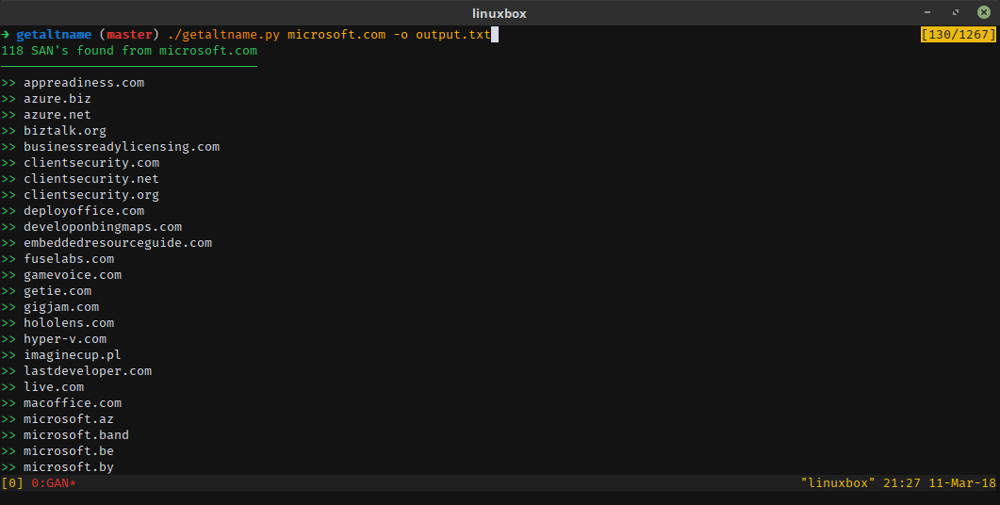

# GetAltName


GetAltName it's a little script that can extract Subject Alt Names for SSL Certificates directly from **HTTPS** web sites which can provide you with DNS names or virtual servers.

It's useful in a discovery phase of a pen-testing assessment, this tool can provide you with more information about your target and scope.

This code is in alpha stage and has been rewritten from Ruby to Python, it doesn't do as much as it should. lots of things and features are missing, but it delivers, treat it as a quick-dirty-code. More features incoming, also you're welcome to contribute if you want.

You can read more about how this tool works from my post in [getroot.info](https://getroot.info/tip-getaltname/) (in Spanish).

# Usage:
```
usage: getaltname.py [-h] [-p PORT] [-s [timeout]] [-m] [-o OUTPUT] [-c {l,s}]
                     [-d]
                     hostname

positional arguments:
  hostname                              Host to analyze.

optional arguments:
  -h, --help                            show this help message and exit
  -p PORT, --port PORT                  Destiny port (default 443)
  -s [timeout], --search-crt [timeout]  Retrieve subdomains found in crt.sh
  -m, --matching-domain                 Show matching domain name only
  -o OUTPUT, --output OUTPUT            Set output filename
  -c {l,s}, --clipboard {l,s}           Copy the output to the clipboard as a
                                        List or a Single string
  -d, --debug                           Set debug enable
```

You can output to a text file and **also copy the output to you clipboard** as a **L**ist or a **S**ingle line string, which is useful if you're trying to make a quick scan with _Nmap_ or other tools.

# Example
In this case the tool give you sub-domains that you probably didn't find with a sub-domain brute force tool.



# Installation
Required libraries:
* colorama
* ndg-httpsclient
* pyperclip
* requests
* tldextract

**Installation with pipenv**:
```sh
$ git clone https://github.com/franccesco/getaltname.git
$ pipenv install
```

**Installation with Pip:**
```sh
$ git clone https://github.com/franccesco/getaltname.git
$ pip install -r requirements.txt
```

For the **copy&paste** mechanism you will have to install xclip package.
**Debian/Ubuntu/Mint:**
```sh
$ apt install xclip
```

# TO-DO
- [x] File output
- [x] Output to clipboard
- [x] Clean sub-domains wildcards
- [x] Remove duplicates
- [x] A filter system for main domain and TLD's.
- [x] Add colors (so l33t. /s)
- [x] Get additional sub-domains from crt.sh

# Contribution

Contribution is welcome, just remember:
* **Fork** the repo.
* Make changes to the **_develop_** branch.
* Make a **Pull Request.**
