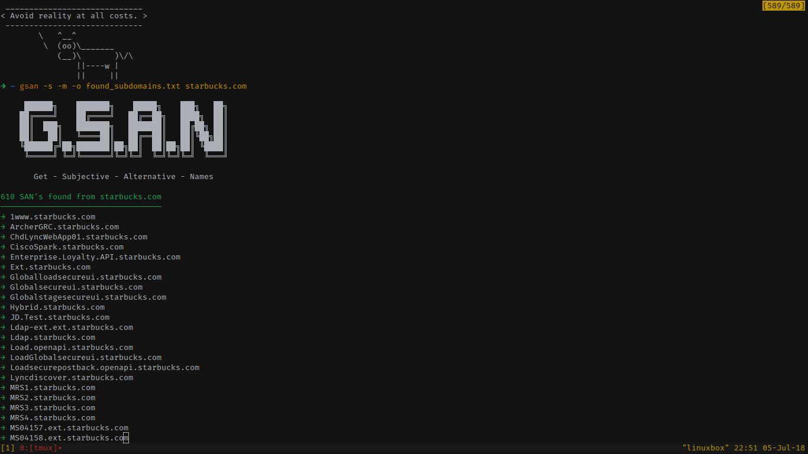

# GSAN (Get Subject Alternative Names)

[](https://pypi.org/project/gsan/) [](https://pypi.org/project/gsan/) [](https://travis-ci.org/franccesco/getaltname) [](https://coveralls.io/github/franccesco/getaltname?branch=master) [](https://github.com/franccesco/getaltname/blob/master/LICENSE.md)


**GSAN** (**G**et **S**ubject **A**lternative **N**ames) is a tool that can extract [Subject Alternative Names](https://en.wikipedia.org/wiki/Subject_Alternative_Name) found in SSL Certificates **directly** from **HTTPS** web sites which can provide you with DNS names (subdomains) or virtual servers.

This tool extract subdomain names from http**s** sites and return a list or json output of its findings. It is _**not**_ a subdomain brute-force tool, and you can [actually find those subdomains manually](https://gfycat.com/AnotherDizzyDodobird), this tools is about the automation of that process, it also offers the following features:
* Input a single **host or Nmap XML file** to scan and return subdomains.
* **List or JSON output**, useful if you want to export data into other tools.
* You can _optionally_ **filter out domain names** that doesn't match the domain name that you're analyzing.
* **Integration with crt.sh** so you can extract more subdomains from certificates of the same entity.
* Also works with **Self-signed** certificates.
* **Copy to your clipboard** the domain names as a _list_ or _string_ if you don't want to deal with files, this is also useful for tools that doesn't accept file input.

You can read more about how this tool works from my post in [getroot.info](https://getroot.info/tip-getaltname/) (in Spanish).

# Usage:
```

     ██████╗    ███████╗    █████╗    ███╗   ██╗
    ██╔════╝    ██╔════╝   ██╔══██╗   ████╗  ██║
    ██║  ███╗   ███████╗   ███████║   ██╔██╗ ██║
    ██║   ██║   ╚════██║   ██╔══██║   ██║╚██╗██║
    ╚██████╔╝██╗███████║██╗██║  ██║██╗██║ ╚████║
     ╚═════╝ ╚═╝╚══════╝╚═╝╚═╝  ╚═╝╚═╝╚═╝  ╚═══╝

       Get - Subjective - Alternative - Names

usage: gsan [-h] [-p PORT] [-s [timeout]] [-m] [-q] [-o OUTPUT]
                   [-f {json,text}] [-c {l,s}] [-d] [-V]
                   hostname

positional arguments:
  hostname                              Host or Nmap XML to analyze.

optional arguments:
  -h, --help                            show this help message and exit
  -p PORT, --port PORT                  Destiny port (default 443)
  -s [timeout], --search-crt [timeout]  Retrieve subdomains found in crt.sh
  -m, --match-domain                    Matching domain names only
  -q, --quiet                           Supress output.
  -o OUTPUT, --output OUTPUT            Set output filename
  -f {json,text}, --format {json,text}  Set output format
  -c {l,s}, --clipboard {l,s}           Copy the output to the clipboard as a
                                        List or a Single string
  -d, --debug                           Set debug enable
  -V, --version                         Print version information.
```

# Example
In this case the tool give you sub-domains that you probably didn't find with a sub-domain brute force tool.



# Demo
*Disclaimer: The tool was renamed from getaltname to GSAN.*
[](https://asciinema.org/a/bYYnK76AQJZFP9hj43e3CUaH5)

# Installation
```bash
$ pip install --user gsan
```

# TO-DO
- [x] File output
- [x] Output to clipboard
- [x] Clean sub-domains wildcards
- [x] Remove duplicates
- [x] A filter system for main domain and TLD's.
- [x] Add colors (so l33t. /s)
- [x] Get additional sub-domains from crt.sh
- [x] Read Nmap XML and analyze them
- [x] JSON Output
- [x] Unit Tests
- [x] Coverage Reports

# Contributors
* [**Djerfy**](https://github.com/djerfy) - **JSON output**.

# Contribution Guidelines
Contribution is welcome, just remember:
* **Fork** the repo.
* Make changes to the **_develop_** branch.
* Make a **Pull Request.**

# Support this project
If you like the project and would like to support me you can buy me a cup of coffee, you will also be inmortalized as a patreon, thank you 🙏

<a href="https://www.paypal.me/orozcofranccesco">
  
</a> <a href="https://www.buymeacoffee.com/franccesco" target="_blank"></a> <a href='https://ko-fi.com/V7V8AXFE' target='_blank'></a>
